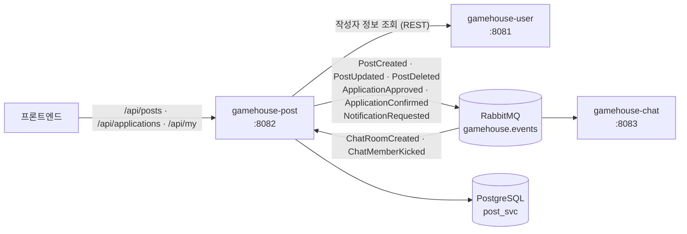

# gamehouse-post

GameHouse의 **모집글** 서비스. 같이 게임할 사람을 구하는 글을 올리고,
지원을 받아 승인하고, 파티가 확정되기까지의 과정을 담당한다.

---

## 1. 좌표

GameHouse는 서비스별로 레포가 분리된 MSA다. 이 레포는 그중 `post` 하나다.

| 서비스 | 포트 | 담당 |
|---|---|---|
| `gamehouse-user` | 8081 | 회원·인증·친구·알림 |
| **`gamehouse-post`** | **8082** | **모집글·파티** |
| `gamehouse-chat` | 8083 | 1:1 · 파티 채팅 |
| `gamehouse-riot` | 8084 | Riot API 연동 |
| `gamehouse-match` | 8085 | AI Team Fit 추천 |
| `gamehouse-crew` | 8086 | 하우스(크루) |

공통 코드(JWT 검증, 전역 예외 처리, 이벤트 계약)는 `gamehouse-common`을
GitHub Packages에서 받아 쓴다. 배포 매니페스트는 `infra` 레포에 있다.

---

## 2. 서비스 관계도

post는 이벤트를 **가장 많이 발행하는 서비스**다. 글이 만들어지고 지원이 승인될 때마다
chat이 채팅방을 만들어야 하고, user가 알림을 넣어야 하기 때문이다.
반대로 chat이 방을 만들거나 멤버를 내보내면 그 결과를 이벤트로 되돌려받아 파티 상태에 반영한다.

DB 권한이 서비스별로 갈려 있어 다른 스키마를 직접 건드릴 수 없고, 상태 변화는 전부 이벤트로 오간다.

---

## 3. 담당 도메인

| 도메인 | 하는 일 |
|---|---|
| **모집글** | 작성 · 수정 · 삭제 · 목록 · 상세 · 마감 |
| **게임 옵션** | 게임별 포지션·티어 등 선택지 제공 |
| **지원** | 지원 · 지원 취소 · 지원자 목록 |
| **승인 흐름** | 승인 · 거절 · 최종 확정 |
| **내 활동** | 내가 쓴 글 · 내가 지원한 글 |
| **파티 구성** | 확정된 멤버로 파티를 꾸리고 정원을 관리 |
| **내부 API** | 다른 서비스가 쓰는 파티 정보 조회 |
